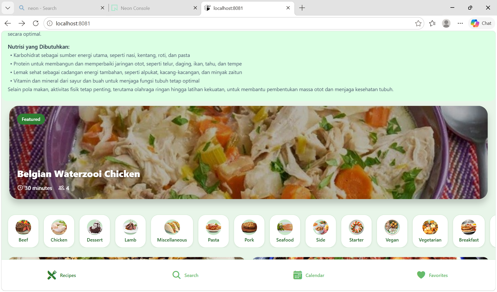
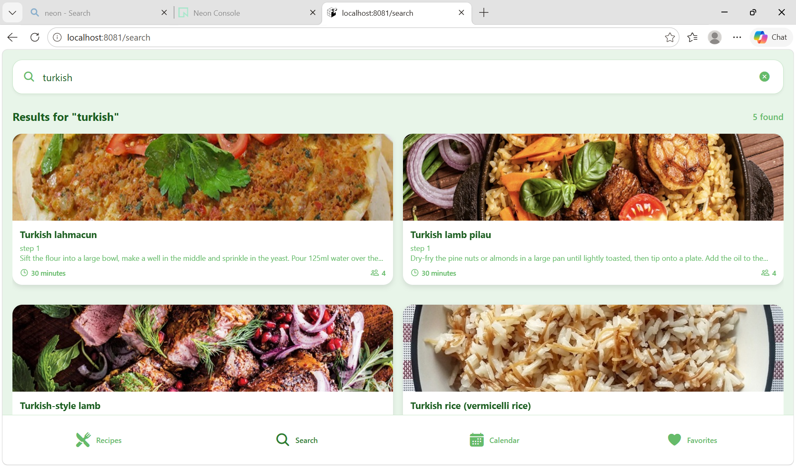
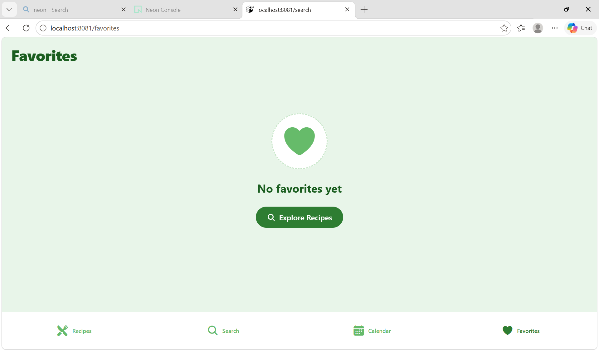
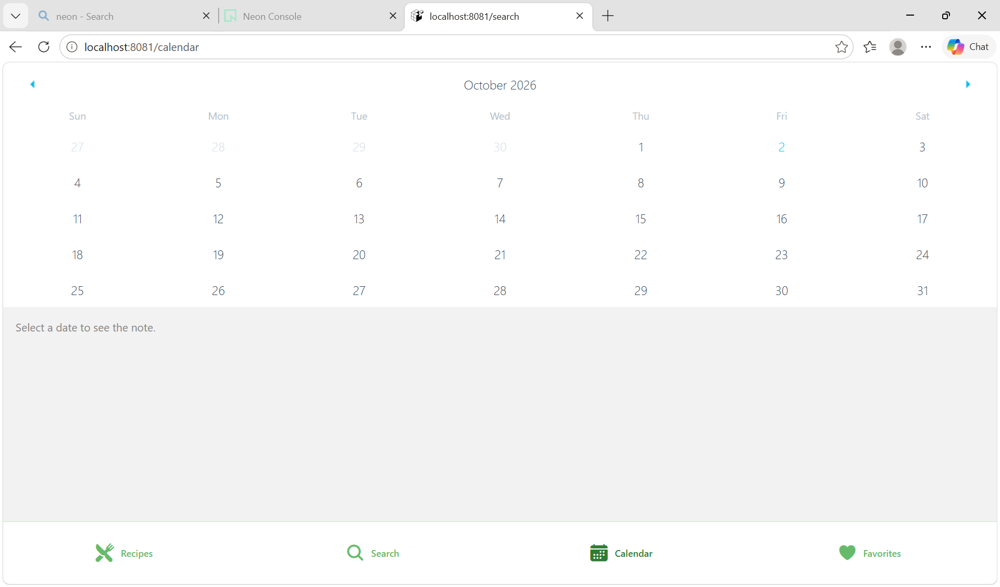

## About the Project

AI Recipe App is a cross-platform recipe discovery application built with React Native and Expo.

The application integrates recipe data from TheMealDB, a Node.js and Express backend, PostgreSQL with Drizzle ORM, and a Python machine learning model for meal classification.

The project was developed as a group Artificial Intelligence course project.

---

## App Preview

<p align="center">
  
</p>

### Search

<p align="center">
  
</p>

### Favorites

<p align="center">
  
</p>

### Calender

<p align="center">
  
</p>

## Features

- Recipe discovery
- Search recipes by name
- Filter recipes by category
- View recipe details
- Save favorite recipes
- Remove favorite recipes
- Store favorites in PostgreSQL
- AI-based meal classification
- Personalized meal planning interface
- Cross-platform support with Expo

---

## Tech Stack

### Mobile
- React Native
- Expo
- Expo Router
- Axios

### Backend
- Node.js
- Express.js
- Python Shell

### Database
- PostgreSQL
- Neon
- Drizzle ORM

### Machine Learning
- Python
- Pandas
- Scikit-learn
- Joblib

### External API
- TheMealDB

---

## Project Architecture

```text
                TheMealDB API
                     │
                     ▼
             React Native / Expo
                     │
                     ▼
             Node.js + Express
                │           │
                ▼           ▼
             Neon DB     Python ML
                            │
                            ▼
                   meal_classifier.pkl
